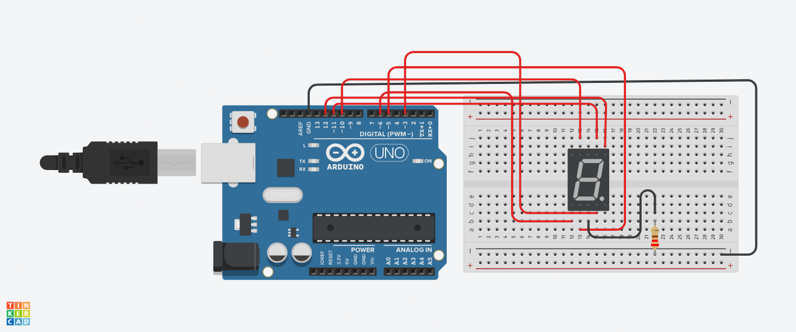

# Arduino nas quartas
Encontro na 42 ás quartas feiras para brincar com o arduino.

## Primeiro encontro (31/05)

  - Aprendendo conexões basicas com leds

## Segundo encontro (07/06)
  - Display de 7 segmentos

https://www.tinkercad.com/things/lSsYbQbL1IN?sharecode=oHxNC3BFcI2GktoFQMZ3JMtzTMLvVoFHFK0qfRaSVlA
  
  [_] Codar desafio: ligar segmentos de forma aleatorea
  
  links utils:

  https://www.instructables.com/Using-a-4-digit-7-segment-display-with-arduino/

  http://www.xlitx.com/Products/7-segment-led-dot-matrix/3461as.html

  https://osoyoo.com/2017/08/08/4-digit-7-segment-led-display/
  
  https://forum.arduino.cc/t/4-digit-7-segment-led-display-is-showing-each-digit-sequentially-not-all-at-once/645973
  
  https://www.hackster.io/meljr/sparkfun-com-11408-4-digit-7-segment-display-hookup-guide-4b4d9e
